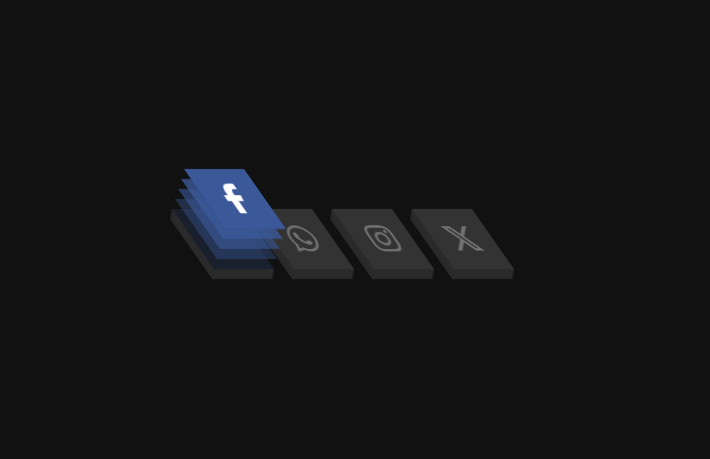

# Dia 1 - Ícone de mídia social em camadas

## Resultado

## Meu relato

Confesso que tive que da uma pesquisadinha por causa da rotação kkkk mas de resto foi o que imaginei, elementos por trás e quando tiver o efeito de hover mexemos com o translate.

## Aprendizado

Nesse desafio aprendi bastante sobre a propriedade **transform** e como podemos utiliza-la para animar nossos componentes.

De quebra ainda tive que pesquisar como usava o rotate e seus eixos, muito bacana.

### O que reforcei

1. Seletores como: **nth-child**, **before** e **after**.
1. Transform: **tipos**, **temporização**, **velocidade de animação**, **delay** e etc.
1. Rotate: X, Y, Z.
1. Elementos 3D.
1. Animações.
