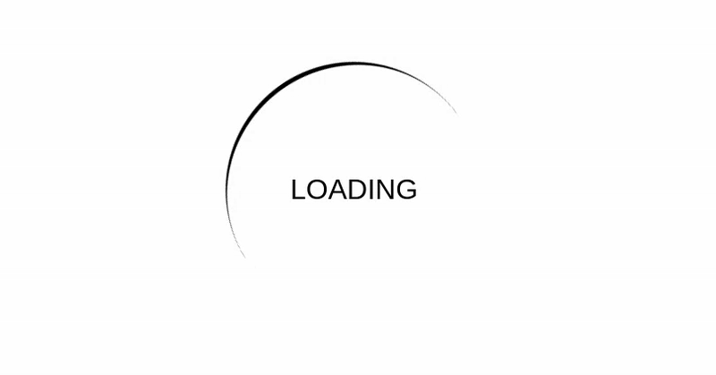

# Dia 2

## Resultado

## Meu relato

Esse foi bem tranquilo, tive apenas que usar um keyframe para rotacionar uma div que estava atrás do texto onde adicionei uma borda apenas no bottom e deixei o elemento redondo com border-radius para criar o efeito.

## Aprendizado

Rotacionar elementos com o transform e o rotate juntamente com keyframes para criar animações.

### O que reforcei

1. **Border**
1. **border-radius**
1. **Animation**
1. **Transform**
1. **Rotate**
