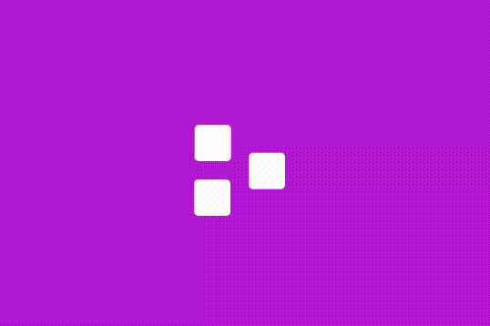

# Dia 7

## Resultado

## Meu relato

Esse também foi bem tranquilo, eu já sabia o que fazer, o que foi "complicado" é definir os px certinho e para qual lado cada bloco ia se mexer.

## Aprendizado

Aprimorei o translate nos sentidos X e Y, de quebra ainda mexi mais ainda com delay.

### O que reforcei

1. **TranslateX**
1. **TranslateY**
1. **Animation**
1. **Delay**
1. **Keyframes**
